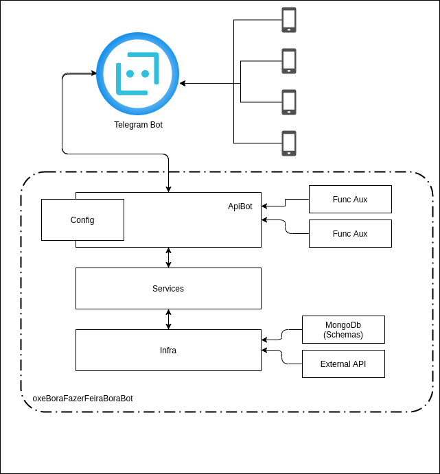

## About this project

*[click here to Portuguese Version](/readme/portugues.md)*

### MVP
>

### Architecture:

> This Project was planned to have a simple architecture with the matter of reaching the delivery on time, however using the good software development practices.

> Exemple:
> - 
> - 
> - 

>
> #### Structure of directories:
>```sh
>src
>│
>└────app
>│      └───controllers
>│      └───services
>│      └───schemas
>│      └───error
>│      └───infra
>│            └──config
>│            └──database
>└───main
>     └───Bot
>     └───middleware
>     └───config
>```
>
>#### Architecture Diagram:
> 

### Data Base:
> It was used the mongoDb on this Project because of it is simple to work, flexible to manipulate and save Shop data.

### Libs used:
>   **Typescript:**
>My motivation in using typescript was to facilitate my understanding and help me to be more productive.
>
> **Telegraf**
> That make it simple develop and interact with telegram bots. [link](https://telegraf.js.org/)


### Executing the Project (env: Local)

> 

### Executing the Testes (env: Local)

>

### Deploy:

> To generate a build to this project, execute the commands:
>```sh
> $ yarn
> $ yarn build or npm build
>```
> Ready! The javascript files will be created in this directory: "/dist".


